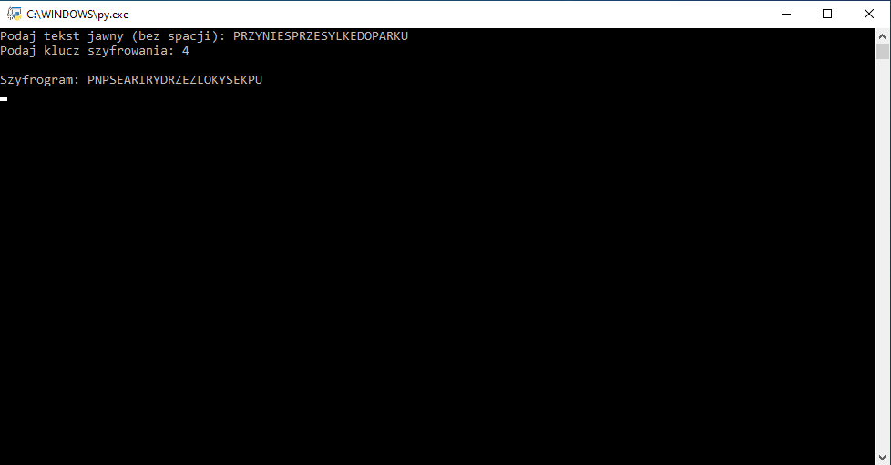

# columnar-cipher
A program that encrypts text entered from the keyboard with a columnar cipher with a given key.

Live demo [_here_](https://replit.com/@BartlomiejLis/columnar-cipher).

## Table of Contents
* [Tech Stack](#tech-stack)
* [Screenshots](#screenshots)
* [Run Locally](#run-locally)
* [Project Status](#project-status)
* [Acknowledgements](#acknowledgements)
* [Authors](#authors)

## Tech Stack
- Python

## Screenshots


## Run Locally
Clone the project

```bash
  git clone https://github.com/bartlomiejlis/columnar-cipher.git
```

Go to the project directory and run main.py with Python.

The program works in a text form. Follow instructions on your screen to start using it.

## Project Status
Project is: _no longer being worked on_.

## Acknowledgements
This project is based on one of the exercises from the textbook on computer science for high schools and technical colleges - "Informatyka na czasie 3", Nowa Era publishing house.

## Authors
Created by Bartłomiej Lis - feel free to contact me at lisu.b117@gmail.com!
